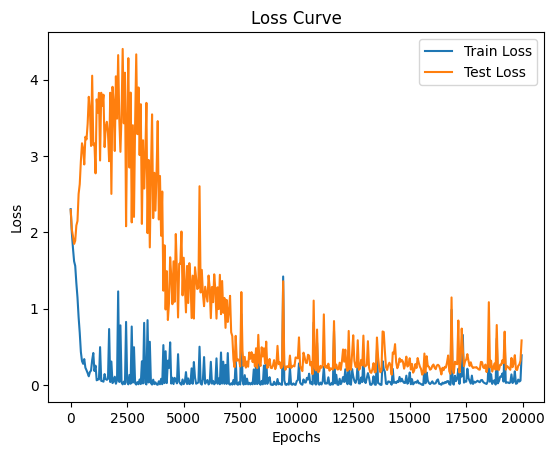

# Numpy GPT

This is a minimal implementation of a GPT-style transformer using only numpy. 

Given that numpy is exclusively CPU-bound, it restricts the training to relatively small-scale models. I was able to conduct a [miniaturized version](adder_grokking_exp.ipynb) of the grokking experiment on a 1 layer toy model in [Nanda et al. 2023](https://arxiv.org/abs/2301.05217).

